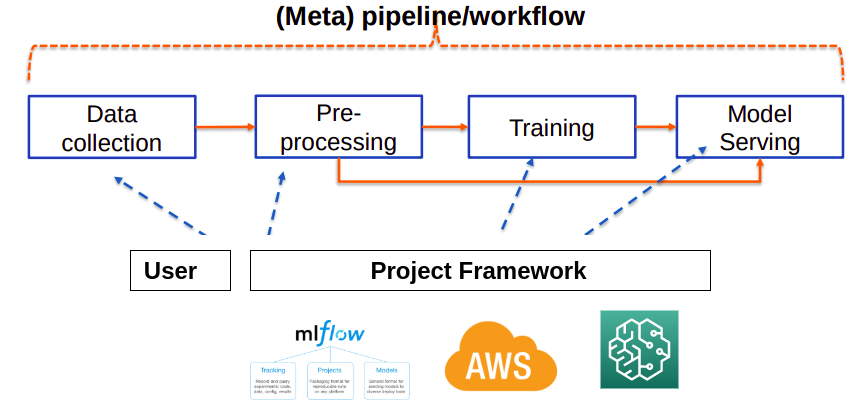
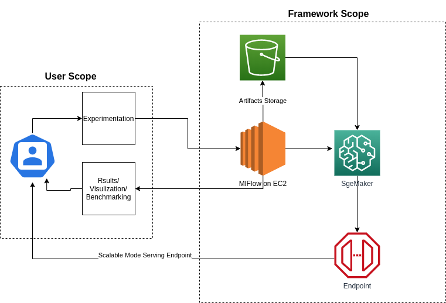
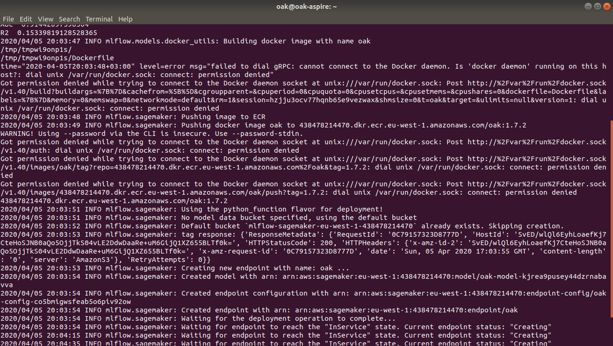
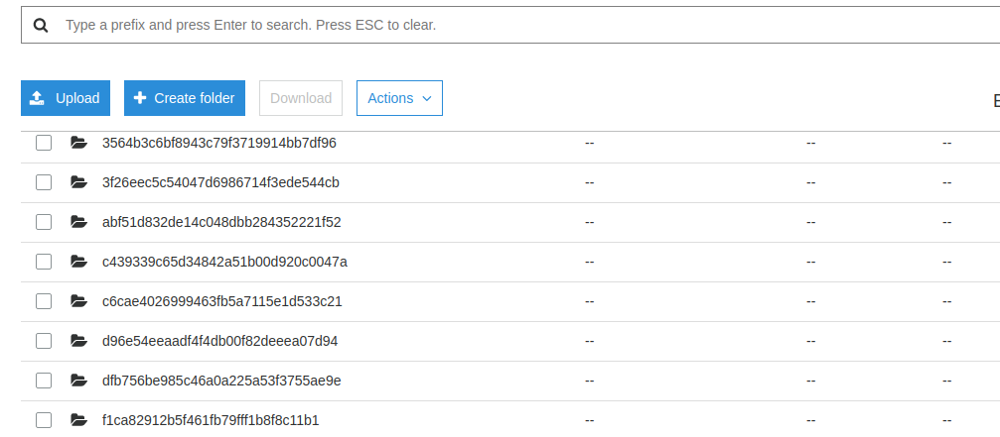
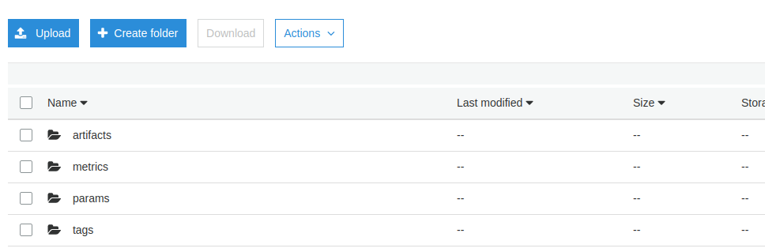
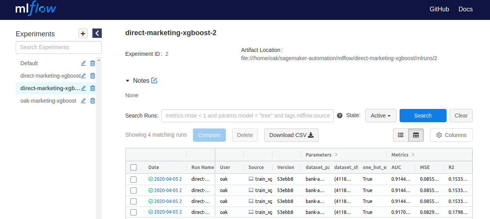
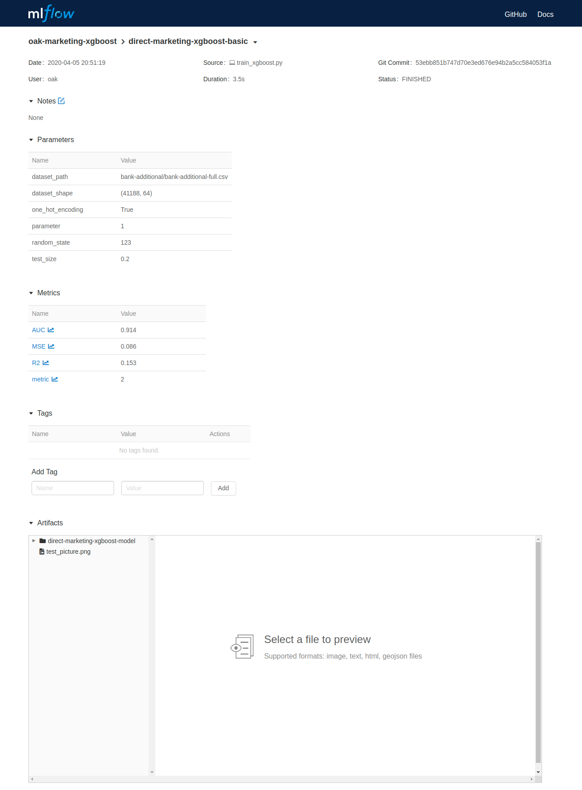
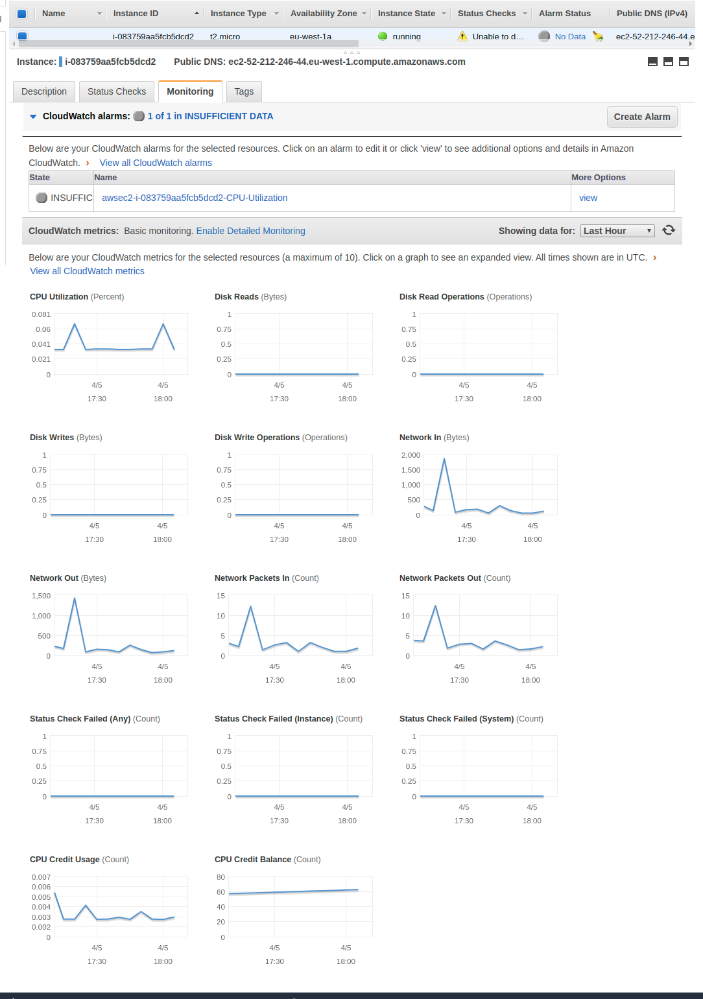
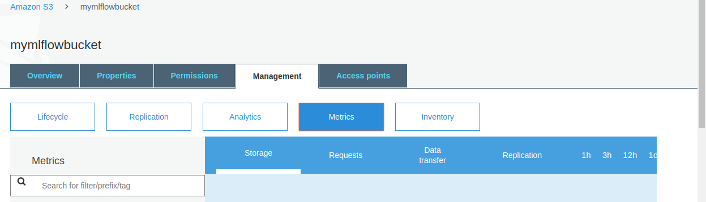
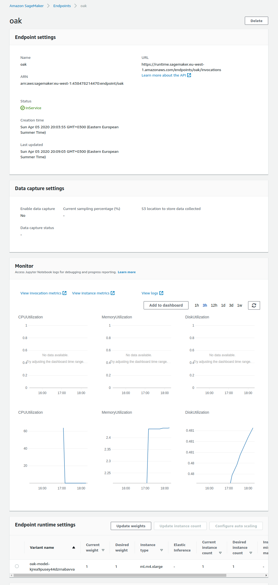

# **STUDY LOG 4 (Project Report)**

Author:

Omer Ahmed Khan

802062

omer.khan@aalto.fi

# CS-E4002 - Special Course in Computer Science: Advanced Topics in Systems for Big Data and Machine Learning

SPRING 2020

Modeling Automation - From Human to Machine

The main concept of this project to enable the customer/user to experiment and deploy his Machine Learning Models to cloud which in the end result provide highly scalable endpoints which can be consumed as per customer application. This project is merely a platform which can be used for multi-users with no restrictions of which dataset or Machine learning algorithms to be used. The experimentation and data will be provided by the customer which will be validated by his own rules on our platform and then provide experiments results, which then be published ton demand to serve scalable solution.

From the course study, a different concept was utilized to model this solution. From the most famous R3E (Reliability, Resilience, Robustness & Elasticity), I emphasize on Elasticity which enables scaling and then robustness which allows users to experiment with rapidness. Moreover, from the F3 (Frameworks), I used the open-source framework MLFlow, which is contributed and used by many professionals. From this, I focus on two concepts, or rather two methodologies to provide a final solution

* Orchestration to enable Experince Management through MLflow

* Model serving by deploying the final model to cloud to provide Elasticity

A higher level of flow diagram could be seen as below:

To understand this, we can easily able to see that there are two contributors to this system. One is the user itself who want to get services and Framework itself. The responsibility is divided as follow:

USER:

* Should create a script to do his experimentation. This script should follow some guideline provided by Framework. It can include some config file for data validation and code structure.

* Execute all experimentation on provided MLFlow tracking URI

FRAMEWORK:

* Should execute experiment provided by users

* Provide Experiment Management View (Provided by MLflow)

* Store Artifacts to specific locations on the cloud

* Deploy Model to Sagemaker to provide a scalable endpoint to serve the model

## Architecture:

There are two scops for an end to end solution, one is what the user gets and on is what and how the framework provides services. The framework work over AWS cloud services. The MLFlow is deployed over EC2 where are the experimentation management will occur. The user needs to use the Tracking URI to perform his experimentation. The artefacts produced by this experimentation will store to S3 buckets which then utilize to deploy the final solution to Sagemaker as a docker image. 

The user can see the results of his experimentation on MLFlow UI which is deployed over EC2, and can have a visualization of his results and experiment management. On his wish then he can issue a request to deploy the final solution as an endpoint service point, which convert models as a server. Which means the model will transform to an HTTP request which is provided with a data sample can return the predicted result.

The Architecture is defined in a way that it can provide with high Elasticity. The ML FLow is deployed over EC2 behind a load balancer which will autoscale its instance with the load. Due to which the Mlflow instance will be scale with high throughput. Moreover, the artefacts are store in AWS scalable storage S3 which is handled by AWS itself with a prominent feature of elasticity. Furthermore, to do ML model serving we are using AWS Sage maker which is again a scalable service which deploys an image of ML model and then AWS handles its elasticity its self.

# Results and Monitoring

There are certain monitoring and logging done in a framework. Most of the monitoring done by AWS CloudWatch or simple AWS modules consoles, which can provide us with all the traffics insight and the resource allocation and utilization. One of our critical deploying script which deploys on-demand ML model to Sagemaker store logs as follows:

This is minimal logs which are created IF the image is already created otherwise the process takes more time and all the dependencies logs are generated. In deploying process certain things take parts like we need to have artefacts store in a bucket to have proper versioning and scalability. The artefacts in a bucket look like below:

All the experimentation are secured and scale with s3, which then utilize by MLflow framework from our EC2 instance to do experiment management and visualization of results and by our Sagemaker to create a Docker container and then deploy it with automated fashion to generate us with endpoint yet to be utilized by the user.

It’s up to the user of how and what he wants to see on Mlflow application, as we are not concerned with what he codes or use, we just show him of the results he logs into ML flow framework, some of the snippets from different results are as follow from Mlflow Experiment management platform.

As you can see, a user can publish its experiment and can easily monitor. This feature, however, belongs to MlFlow framework and my project is just utilizing it. But my project allow users to store all its experimentation on my platform which can be reused in future in anyways. These experimentations can log metric and graph which can be used to compare the result and to make the decision of which model need be deployed further to create an endpoint for related application.

This was, however, is a story from a user perspective. The monitoring done from the platform is different and a customer/user is of no concern of them. However, as a platform engineer, we need to monitor them and put alerts on them to identify pressing or critical bugs and issues which can bring our system down. These measures can cover yet again in another **R3E **of being robust in approach and detect any resource or technical issues. Follow are the resulting monitoring from the AWS platform which is tightly coupled with our platform modules.

The above image shows the resource utilization on our MlFlow EC2 instance which is our main point of contact to a customer. The Mlflow Tracking server and a small Flask server is built on this EC2 which serve Customer request either of experimentation or on-demand ML model deployment. This instance is behind load balancer to avoid any jam from the load and to maintain availability. Furthermore, we also need to monitor Sagemaker endpoint, below images can describe how it utilizes resources. However, this management solely handles by AWS so we do not need to apply any load balancer or anything but we need to monitor pr apply appropriate alarms to avoid any breakage. (PLEASE REFER IMAGE AFTER THIS PAGE)

Another thing we could monitor but it asking for more money so I didn’t enable  It can help us to monitor our S3 storage which needs to be controlled at some point as we need to limit our Customer on experimentation or charge them for extra experimentation artefacts storage.

## Conclusion:

Overall my platform is a layer over MLFlow framework which enables users to do experimentation and deploy his perfected model over AWS Sagemaker making it Elastic and robust platform to usee. MLflow itself is just an open-source project which doesn’t provide elasticity thus my project is to make the use of the framework to make it scalable and making it much easier to use by the different business application. The concept of this project comes with previous course Big Data Platform in which we are not concerned with the data but to provide a platform which enables different customers and solutions to be build be deployed over it.

CS-E4002 - ProjectReport.md
Displaying CS-E4002 - ProjectReport.md.
